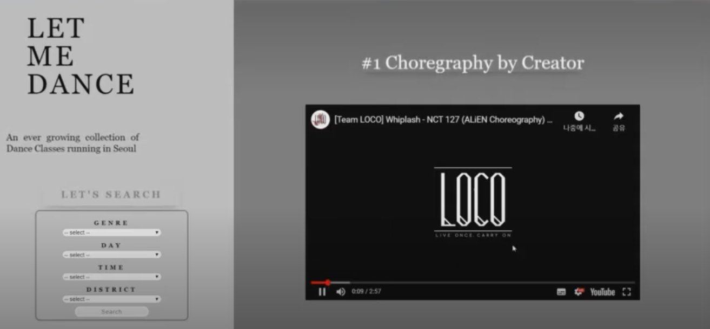
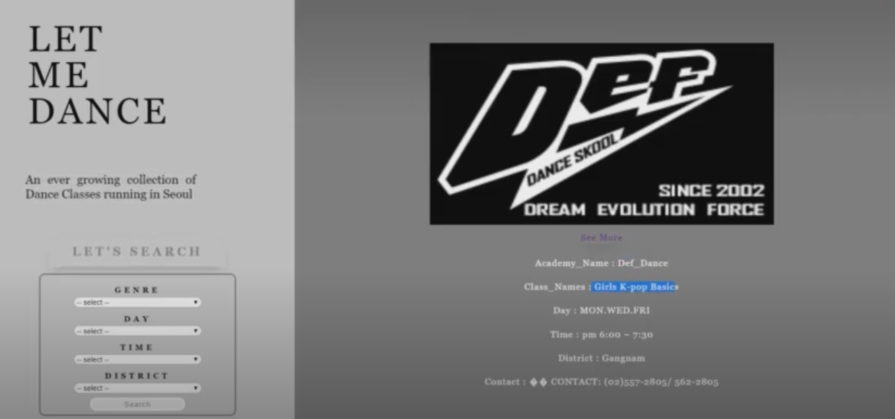
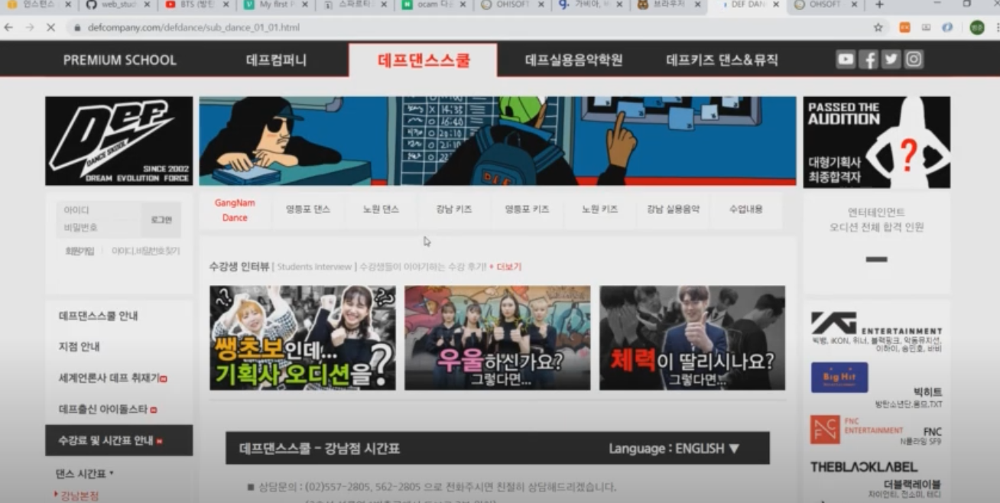

# Product Name
> 2020 April Seoul Dance Academy Search 

## Tech/framework used
1) Front-End
- HTML,SCSS
- Framer-Motion
1) Back-End
- Flask
- MongoDB
1) Web Scrapping
- Python

## Product Introduction 
You can see the lists of Dance Academy List
availabe in 2020.04  

몸치이지만 춤을 배워보고 싶으신 분, 
손쉽게 자기가 원하는 댄스 수업을 찾고 싶으신 분들을 위한 플랫폼입니다. 

장르, 시간, 요일, 지역구 를 검색하면, 해당 클래스 목록이 뜹니다.

## Product Description

 

### 1) MainPage

Displaying All Lists of Albums
with Slide Shows

 
 

### 2) Search Page

You can choose
'Genre'
'Day'
'Time'
'District'

and search proper dance acaemy lists

 
 

There is a also link attaced to it
so that you can move to according website

 
 

## Release History

* 0.0.1  (2020.06.07)
* Work Done (React,Typescript,NodeJS,Scrapping)

## Meta

OH BUM JUN  – beomjun0638@hanmail.net

[https://github.com/ohbumjun/Flask_DanceAcademySearchApp](https://github.com/ohbumjun/Flask_DanceAcademySearchApp)

